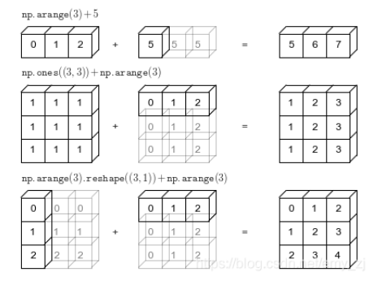
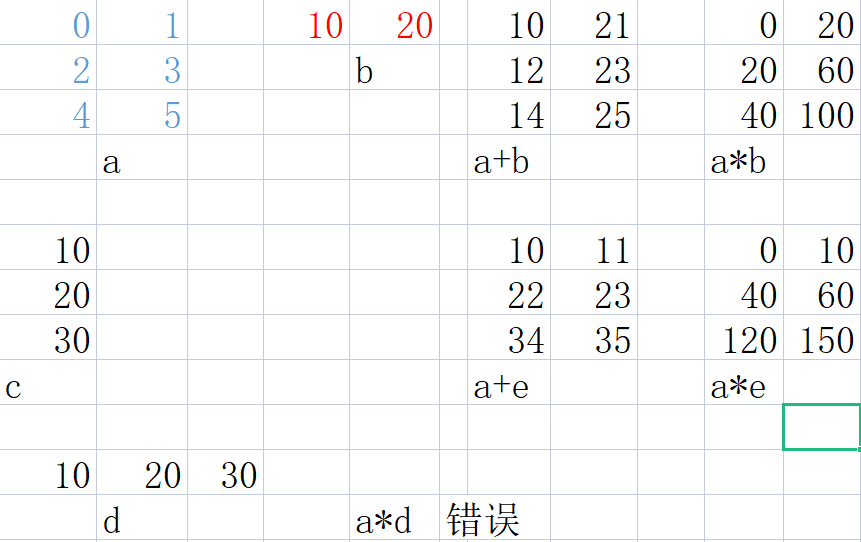

# Numpy 的学习使用方法

## (2,)与(2,1)的区别

numpy.ndarray.shap是返回一个数组维度的元组。 (2,)与(2,1)的区别如下：

ndarray.shape：数组的维度。为一个表示数组在每个维度上大小的整数元组。例如二维数组中，表示数组的“行数”和“列数”。
ndarray.shape返回一个元组，这个元组的长度就是维度的数目，即ndim属性。
一般情况下：

[1,2]的shape值(2,)，意思是一维数组，数组中有2个元素。

[[1],[2]]的shape值是(2,1)，意思是一个二维数组，每行有1个元素。

[[1,2]]的shape值是（1，2），意思是一个二维数组，每行有2个元素。

## 各个函数的使用

### np.array

```python
import numpy as np

# 建立一個陣列 (數組)
test = np.array([9, 4, 8, 7])
# 印出型別
print(type(test))
print(test.shape)
print(test[0], test[1], test[2], test[3])
test[0] = 5
print(test)
# 建立一个二维数组
npt = np.array([[6,8,9],[4,8,7]])
print(npt.shape)
print(npt[0, 0], npt[0, 1], npt[1, 0])
```

### np.ones()

### np.zeos()

### np.full()

### np.eye()

### np.empyt()

```python
import numpy as np

# 建立全 0 陣列
a = np.zeros((2,2))
print(a)

# 建立全 1 陣列
b = np.ones((1,2))
print(b)

# 建立全 7 陣列
# Create a constant array
c = np.full((2,2), 7)  
print(c)

# Create a 2x2 identity matrix
d = np.eye(2)
print(d)
e = np.empty(d)
print(e)

```


### dtype 

#### np.int64

#### np.float64

```
import numpy as np

x = np.array([1, 2])
print(x.dtype)

x = np.array([1.0, 2.0])
print(x.dtype)

x = np.array([1, 2], dtype=np.int64)
print(x.dtype)
```

### like函数

### np.empty_like()

### np.ones_like()

np.ones_like() 返回与输入数组形状相同，但元素全为 1 的数组；

### np.zeros_like()

p.ones_like() 返回与输入数组形状相同，但元素全为 0的数组；

## numpy数组的计算关系

### 数值计算

```python
import numpy as np

x = np.array([[1,2,3], [4,5,6], [7,8,9], [10, 11, 12]])
v = np.array([1, 0, 1])
y = np.empty_like(x)

for i in range(4):
    y[i, :] = x[i, :] + v
print(y)
```

### 广播机制

numpy中维度的对应顺序是倒着对应，两个数组倒数第一个维度相互对应，接着是倒数第二维，如此类推。element-wise的运算，当两个数组总维度不相同时，广播界定了是否能运算，能运算的话该按什么规则运算，厘清了这个场景下的计算规则问题。

```
"""
两个n-d数组维度相同时，element-wise运算怎么算很清晰
"""
a=np.random.randint(10, size=[2,5])
b=np.random.randint(10, size=[2,5])
(a+b).shape
Out: (2, 5)

"""
当两个n-d数组维度不相同，但看起来又“像能运算”，广播规则定义了该怎么计算
"""
c=np.random.randint(20, size=[2,2,5])
(a+c).shape
Out: (2, 2, 5)    #广播定义了结果数组该怎么算出来
```

1） 向量和标量运算，标量自动复制扩充为向量

2）矩阵和向量运算，向量在没对齐的维度自动复制扩充为矩阵

3）两个矩阵在两个维度上都不对齐，且都能广播，在每个维度上分别复制扩充



```python

 
"""
1. element-wise 运算，维度对应关系
b的第0维和a的第1维对齐（维度倒着对齐）
b重复和a的每行运算，输入结果为3*2维
"""
b*a
array([[  0,  20],
       [ 20,  60],
       [ 40, 100]])
 
"""
1.1 相应维度不对齐，并且长度都不为1，非法
"""
c*a
ValueError: operands could not be broadcast together with shapes (3,) (3,2) 
 
#c = np.array([0, 1, 2])
d=np.array([[10],[20],[30]])
 
"""
1.2 相应维度可广播
c在行方向复制扩充，d在列方向
"""
d+c
array([[10, 11, 12],
       [20, 21, 22],
       [30, 31, 32]])
 
"""
2.1 非element-wise运算，按运算定义来计算，基础对应维度上不适用广播
    如果基础对应维度不对齐，会直接报错
"""
np.dot(d,c)  
ValueError: shapes (3,1) and (3,) not aligned: 1 (dim 1) != 3 (dim 0)
#np.dot(c,d)是合法的
 
"""
2.2 非element-wise运算
    基础维度合法对齐时，在更高维度上是element-wise对应的（以基础对应块为单位），会适用广播规则
"""
a=np.random.randint(24,size=[2,3,4])
b=np.random.randint(12,size=[4,2])
np.dot(a,b).shape    #能合法进行运算
Out[111]: (2, 3, 2)
```



**如果是一维的数据，那么在计算的过程中，我们需要对应的维度相同，才能够进行计算，否则的话，容易出现错误**

## np.tile函数

Numpy的tile()函数，就是将原矩阵横向、纵向地复制。tile是瓷砖的意思，

顾名思义，这个函数就是把数组像瓷砖一样铺展开来

```

import numpy as np

x = np.array([[1,2,3], [4,5,6], [7,8,9], [10, 11, 12]])
v = np.array([1, 0, 1])
vv = np.tile(v, (4, 4))
print(vv)
vv = np.tile(v, 2)
print(vv)
vv = np.tile(v, (1,2))
print(vv)

"""
[[1 0 1 1 0 1 1 0 1 1 0 1]
 [1 0 1 1 0 1 1 0 1 1 0 1]
 [1 0 1 1 0 1 1 0 1 1 0 1]
 [1 0 1 1 0 1 1 0 1 1 0 1]]
[1 0 1 1 0 1]
[[1 0 1 1 0 1]]"""
```

## np.copy()

[需要区分可变数据和不可变数据类型](https://blog.csdn.net/wumingxiaoyao/article/details/122010313)

np.copy()属于深拷贝,拷贝前的地址和拷贝后的地址不一样. 而 " = " 属于浅拷贝,拷贝后的地址和拷贝前的地址一样.

```python
a ={"name ":'wangxinchao',"age":19}
b = a
a["age"] = 20
print(b)
# {'name ': 'wangxinchao', 'age': 20}

x = [12,3,4,4]
y = x
x[0] = 13
print(x)
print(y)
# [13, 3, 4, 4]

# 失效了
x = 23
y = x
print(y)
x = 23+3
print(y)
# 23
```

## np中随机生成随机数

### 最常用的随机生成函数为rand, randn, randint, choice

它们分别表示0-1[均匀分布](https://so.csdn.net/so/search?q=均匀分布&spm=1001.2101.3001.7020)的随机数组、标准正态的随机数组、随机整数组和随机列表抽样：

```python
np.random.rand(3) # 生成服从0-1均匀分布的三个随机数
np.random.rand(3, 3) # 注意这里传入的不是元组，每个维度大小分开输入

# randn生成了N(0,I)的标准正态分布：
np.random.randn(3)
np.random.randn(2, 2)


# randint可以指定生成随机整数的最小值最大值（不包含）和维度大小
low, high, size = 5, 15, (2,2) # 生成5到14的随机整数
np.random.randint(low, high, size)


# choice可以从给定的列表中，以一定概率和方式抽取结果，当不指定概率时为均匀采样，默认抽取方式为有放回抽样
my_list = ['a', 'b', 'c', 'd']
np.random.choice(my_list, 2, replace=False, p=[0.1, 0.7, 0.1 ,0.1]) # replace=False表示不允许出现重复元素
np.random.choice(my_list, (3,3)) # 当不指定参数时，默认均匀采样，可以出现重复元素

# 当返回的元素个数与原列表相同时，不放回抽样等价于使用permutation函数，即打散原列表
np.random.permutation(my_list)
```

### 对于服从区间a到b上的均匀分布可以如下生成：

```python
#method1
a, b = 5, 15
(b - a) * np.random.rand(3) + a

#method2
np.random.uniform(5, 15, 3)

```

### 对于服从方差为 𝜎2 均值为 𝜇 的一元正态分布可以如下生成：

```python
mu, sigma = 3, 2.5
mu + np.random.randn(3) * sigma

np.random.normal(3, 2.5, 3) # 生成3个服从均值为3，标准差为2.5的正态分布随机数

```

# 维度的转换

## np.reshape函数

```python
# 生成一个二维数据
x = np.array(range(12))
x = np.reshape(x, (3,4))
print(x)
# 输出为：
# [[ 0  1  2  3]
#  [ 4  5  6  7]
x = np.reshape(x, (4,3))
print(x)

x = np.reshape(x, (2,2,3))
print(x)
```

## 在数组的最后一维增加一个维度信息

就是相当于在最后的**数字中给添加一个[]**

```python
# 在多维数组的最后一维再增加一个维度
y1 = np.expand_dims(x, axis=x.ndim)
y2 = np.expand_dims(x, axis=-1)
y3 = x[:,:,np.newaxis]
y4 = np.reshape(x, (*x.shape,1))
# 上述四种方法的结果完全一致
assert(np.all(y1==y2))
assert(np.all(y2==y3))
assert(np.all(y3==y4))
print(y4)
# 输出为：
# [[[ 0]
#   [ 1]
#   [ 2]
#   [ 3]]
 
#  [[ 4]
#   [ 5]
#   [ 6]
#   [ 7]]
 
#  [[ 8]
#   [ 9]
#   [10]
#   [11]]]
```

## 减小一个维度

如果多维数组的最后一维的长度为1，可以将该维去掉，去掉的方法可以使用[numpy](https://so.csdn.net/so/search?q=numpy&spm=1001.2101.3001.7020).reshape或numpy.squeeze，示例如下

```python
# 假设欲将刚才增加一维生成的多维数组y4的最后一维去掉
y = y4
x1 = np.squeeze(y, axis=(y.ndim-1))
x2 = np.squeeze(y)
x3 = np.squeeze(y, axis=-1)
x4 = np.reshape(y, y.shape[:-1])
# 上述四种方法的结果完全一致
assert(np.all(x1==x2))
assert(np.all(x2==x3))
assert(np.all(x3==x4))
print(x4)
# 输出为：
# [[ 0  1  2  3]
#  [ 4  5  6  7]
#  [ 8  9 10 11]]
```

## 将多维数组压缩为一维数组

将多维数组压缩为一维数组，可使用flatten或ravel以及[reshape](https://so.csdn.net/so/search?q=reshape&spm=1001.2101.3001.7020)方法，示例如下：

```python
z1 = y.flatten()
z2 = y.ravel()
z3 = y.reshape(y.size)
# 上述三种方法结果完全一致
assert(np.all(z1==z2))
assert(np.all(z2==z3))
print(z3)
# 输出为：
# [ 0  1  2  3  4  5  6  7  8  9 10 11]
```

## 将多维数组压缩为二维数组，0轴保持不变

在深度学习或强化学习中，有时需要将shape为(batches, d1, d2, d3,...)的多维数组转化为shape为（batches, d1*d2*d3...）的数组，此时可以使用reshape进行转化，示例如下：

```python
#生成多维数据
d0 = np.expand_dims(x, axis=0)
d1 = np.repeat(d0, 3, axis=0)
print(d1)
# 输出为
# [[[ 0  1  2  3]
#   [ 4  5  6  7]
#   [ 8  9 10 11]]
 
#  [[ 0  1  2  3]
#   [ 4  5  6  7]
#   [ 8  9 10 11]]
 
#  [[ 0  1  2  3]
#   [ 4  5  6  7]
#   [ 8  9 10 11]]]
 
 
#转化为二维数组
d2 = np.reshape(d1, (d1.shape[0], d1[0].size))
print(d2)
# 输出为：
# [[ 0  1  2  3  4  5  6  7  8  9 10 11]
#  [ 0  1  2  3  4  5  6  7  8  9 10 11]
#  [ 0  1  2  3  4  5  6  7  8  9 10 11]]
```

